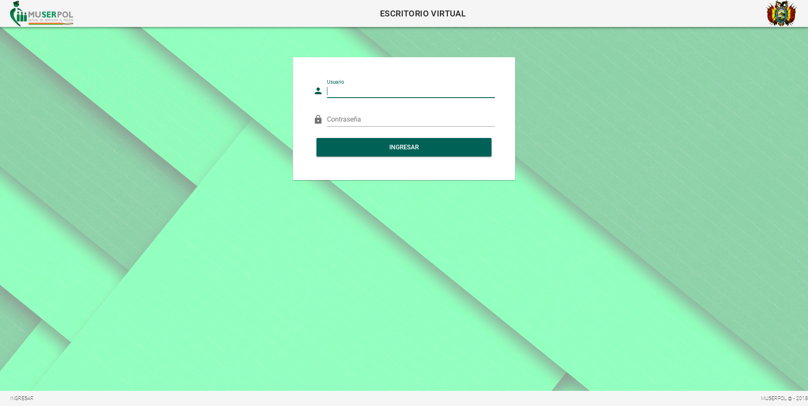
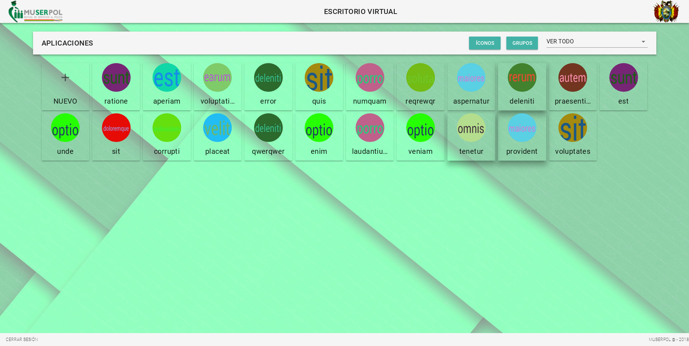
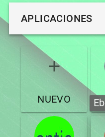
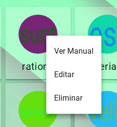
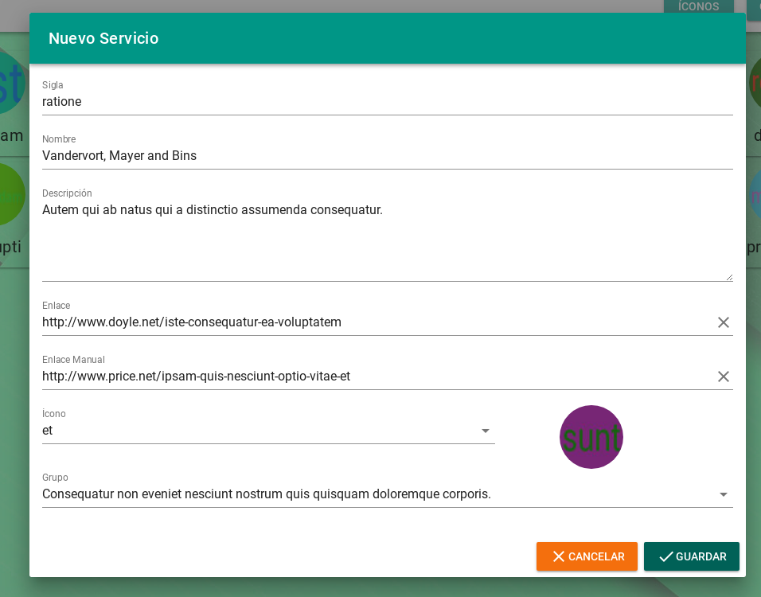
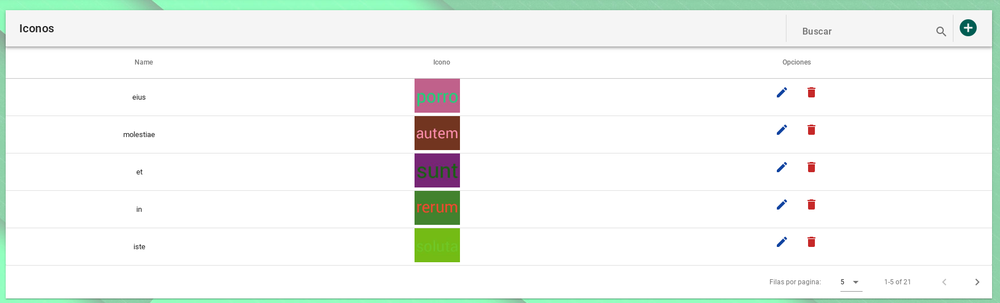
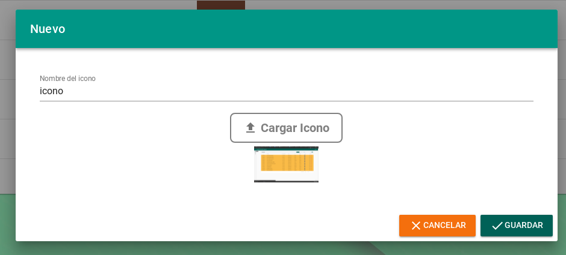
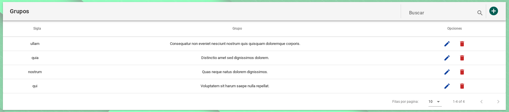
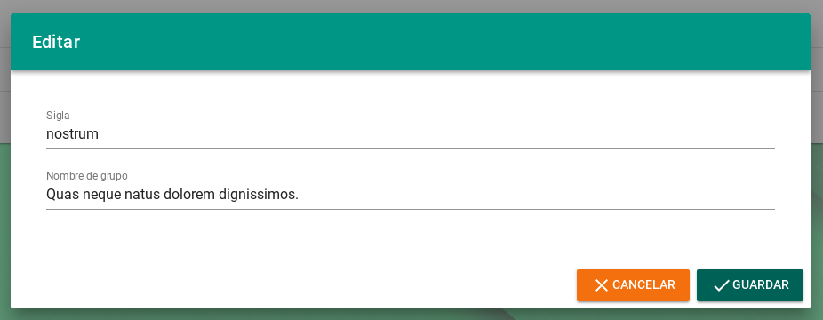

# MANUAL DE USUARIO ESCRITORIO VIRTUAL
1. INGRESO AL SISTEMA.
Este sistema es compatible con los navegadores Firefox y Chrome, para acceder al sistema se debe acceder al enlace:
[http:// intranet.muserpol.gob.bo](http://intranet.muserpol.gob.bo).
Una vez en la dirección debe hacer click en el boton ingresar en la parte inferior izquierda e ingresar las credenciales en los campos de usuario y contraseña adquiridas por el responsable de la Unidad de Sistemas y Soporte Técnico.

* CERRAR SESION. Para salir de la sesión actual bastará con hacer click en la opción Cerrar Sesión en la parte inferior izquierda.

2. GESTION DE SERVICIOS. Vista administrable de servicios.

* . Para añadir un servicio hacer click en la siguiente opción:

* . Para editar un servicio hacer click derecho en un icono y seleccionar la opcion editar:

* Al hacer click en la opcion de nuevo o editar mostrara el siguiente formulario.

* Para eliminar un servicio hacer click derecho en el icono y seleccionar la opción eliminar.

3. GESTION DE ICONOS. Vista administrable de iconos con las opciones de nuevo, editar y eliminar icono

* Para las opciones de nuevo y editar muestra el siguiente formulario:

4. GESTION DE GRUPOS. Vista administrable de grupos con las opciones de nuevo, editar y eliminar grupo.

* Para las opciones de nuevo y editar muestra el siguiente formulario:

